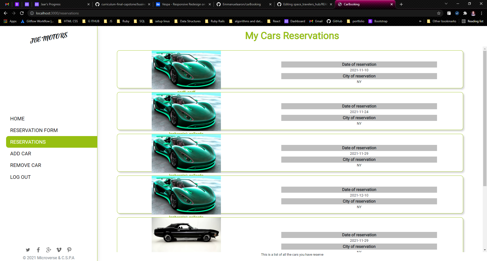
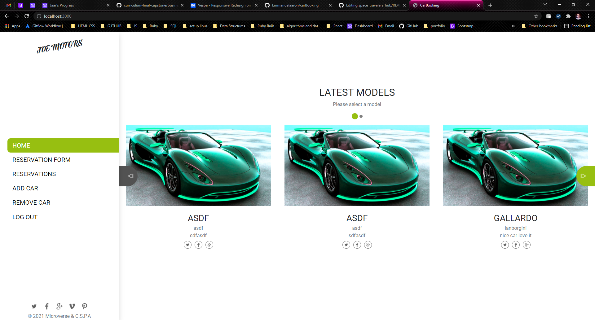
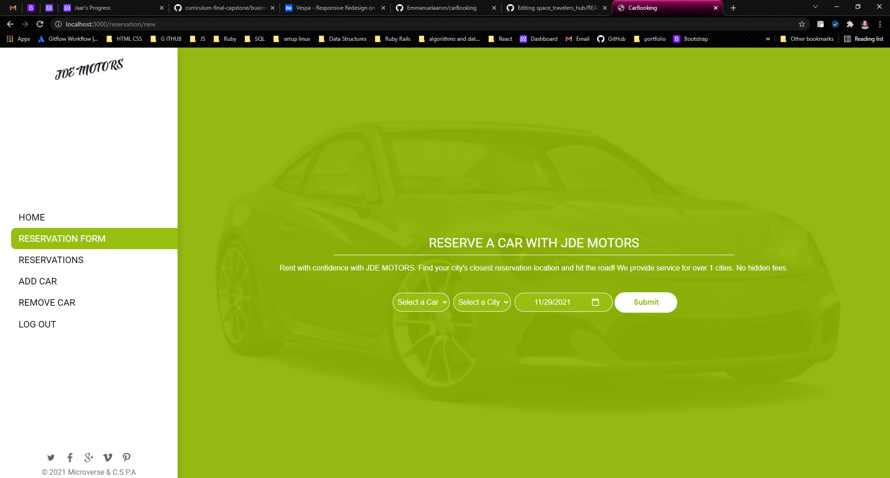
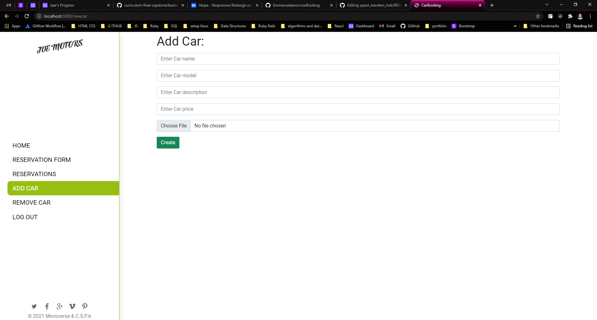

# Car Booking Website

An app was made to book a car to test it before you buy it. The front end was made with react and redux, and the back end was made with rails. The whole page is connected by using API. 

Our main features are:
- Login with authentication token for the API
- The home page displays all the cars and allow you to connect directly to the reservations page
- Reservations form to manually reserve a car
- My reservations show all reservations made by the current user.
- New card page that allows adding new cars.
- Delete car that displays all the added cars and an option to delete each car.


    



## Built With

- Ruby on Rails
- JavaScript
- HTML & CSS
- Bootstrap
- Webpack
- Jest testing framework
- Git and Github pages
- VSCode
- Linter Checkers

## Deployment Live Demo

Deployed with Heroku
  - Not available

## Getting Started

To get a local copy up and running follow these simple example steps.

### Prerequisites

- IDE to edit and run the code (We use Visual Studio Code 🔥).
- [Node.js](https://nodejs.org/en/download/) already downloaded.
- Webpack - [click here to getting started](https://webpack.js.org/guides/getting-started/).

### Install

To get a local copy up and running follow these simple example steps.
- Open terminal
- Clone this project using the command
```
git clone git@github.com:Emmanuelaaron/carBooking.git
```
- Select the folder
```
cd carbooking
```
- To install all project dependencies run:
```
npm install
```
Then type on your terminal :
```
bundle install
```
With this you will install all dependencies por react and redux and also for rails. 
This project saves the pictures using the cloudinary service. First you need to go to the cloudanary website and create and accounts, ist free. Then create a file and name it .env, the you need to typle the following information on it:
```
CLOUD_NAME="cloud name"
CLOUD_API_KEY="paste cloud key here"
CLOUD_API_SECRET="paste the cloud api secret code here"
```
Without this file the app will not work, due to it save all the image file on cloudary and then gets the urp from then.

Now to run the server you need to run the rails server and the deve server. To do that firest type on the terminal:
```
Rils s
```
Now on a new terminal type:
```
npm run dev
```
Now got to [localhost](localhost:3000/)
You will see the login page first.

### API usage
The backed is made with ruby on rails and this works as an API service alone. To use it you need to either create and account or login using:
```
localhost:3000/api/v1/newuser
localhost:3000/api/v1/login
```

You only need to send a username using the body and the api will return the token, you need to save this token in order for you to use any of the other remaining features on the API server.

We also include a home api code on:
```
localhost:3000/api/v1/home
```
This will return all the cars added to the database.

To create new revervations you will use the api:
```
localhost:3000/api/v1/reservations/new
```
You are only require to send:
- token
- car_id
- city_id
- date

To get all the cars again and cities at the same time you can user the api:
```
localhost:3000/api/v1/carsNcities
```
To add new car use:
```
localhost:3000/api/v1/newcar
```
This require:
- name
- model
- description
- price
- image

## Authors 👤 

👤 **Emmanuel Isabirye**

- Github: [@EmmanuelAaron](https://github.com/Emmanuelaaron)
- Twitter: [@EmmanuelAaron](https://twitter.com/EmmanuelIsabir1)
- Linkedin: [@EmmanuelAaron](https://www.linkedin.com/in/fullstackwebdev-emma/)

👨‍💻 ***David Alvarez**

- GitHub: [@petudeveloper](https://github.com/petudeveloper)
- Twitter: [@petudeveloper](https://twitter.com/petudeveloper)
- LinkedIn: [David Alvarez Mazzo](https://www.linkedin.com/in/davidalvarezmazzo/)


👨‍💻 **Jose Alberto Arriaga Ramos**

- GitHub: [@jaarkira](https://github.com/jaarkira )
- Twitter: [@91_jaar](https://twitter.com/91_jaar )
- LinkedIn: [Jose Arriaga](https://www.linkedin.com/in/jaar/)


## 🤝 Contributing

Contributions, issues, and feature requests are welcome!

Feel free to check the [issues page](https://github.com/DanSam5K/Webflix-Index/issues).

## Show your support

Give a ⭐️ if you like this project!


## Acknowledgments

- Hat tip to anyone whose code was used 🔰
- Inspiration 💘
- Microverse program ⚡
- Our standup team 🏹
- Our family's support 🙌

## 📝 License

This project is [MIT](./LICENSE) licensed.
